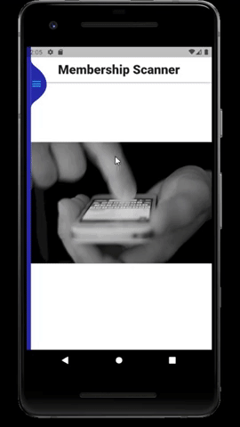
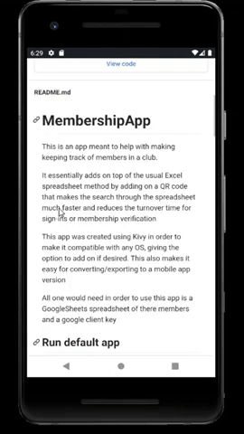
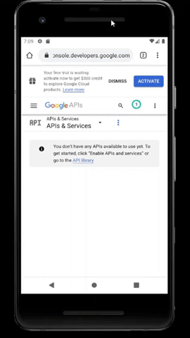
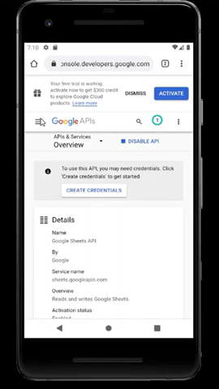
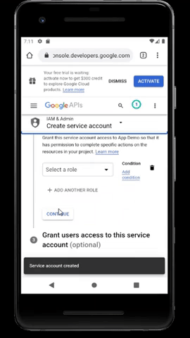

# MembershipApp

This is an app meant to help with making keeping track of members in a club.

It essentially adds on top of the usual Excel spreadsheet method by adding on a QR code that makes the search through the spreadsheet much faster and reduces the turnover time for sign-ins or membership verification

This app was created using Kivy in order to make it compatible with any OS, giving the option to add on if desired. 
This also makes it easy for converting/exporting to a mobile app version

All one would need in order to use this app is a GoogleSheets spreadsheet of there members and a google client key

## Current stable Platforms
- [ ] Windows
- [ ] MacOS
- [ ] Linux
- [x] Android
- [ ] iPhone

## Run default app
In order to run the pre-built app all you need to do is:
1. Download/clone this repository
2. Have the [required components here](#Needed)
3. Run the [specific file for the platform](#Platform-installations) you're using
4. [Run setup](#App-setup)

# Platform installations:

### Windows:
* Run the "Membership.exe" 

### Android:
* Download "bin/membership-[...].apk" to phone
* Tap the download to run/install

### iPhone and Mac (TBD)
...

# Use

### Needed:
* Google credentials file ['client_secret.json'](#Creating-client\_secret-file)
### Optional
* --

# Demos

## App setup:
* Tap menu button in top left of screen, go to Settings
* Set the [`client_secret.json`](#Creating-client\_secret-file) file

* Set club's email
* Set club's name

## Creating client_secret file:

### Activate option to connect:
* Go to this page: https://console.developers.google.com/project
* Select the option to "Create Project", give it a name and create it 

* On the side-left menu go to “APIs & Services > Library”
* Search for and enable both "Drive API" and "Sheets API" respectively 

### Create linking file:
* On the side-left menu go to “APIs & Services > Credentials”
* Choose the option to "Create Credentials” and select "Service Account"
* Give this a name and create it (press continue until it is created) 

* Click on the item you've just created (towards the bottom of the page) and at the bottom of the next page select "Add key > Create new key" 
* Select 'JSON' and create the file. 
* Save this file with the name 'client_secret' to somewhere reachable **THE SAME FILE CAN'T BE DOWNLOADED AGAIN** 

# Developers

### Basic info
(TBA)

### Techincal info
The scanner handles scanning in QRcodes and finding the corresponding memeber in the Google Sheet (Only on mobile).

Member addition and QRcode generation is done from the Add Members page

The settings page is where individual club specfications can be set.

## Installations
(TBA)
## Windows:
(TBA)

# Build app

### Needed:
* --
### Optional
* '.ico' file of club logo (if you want to customize the image of the application)

### Windows
(TBA)

### Android
(TBA)

# To-do
* ~~iPhone app~~
* Use gmail api/google log-in
* Update sheet when settings are editted
* Clean up unnecessary files on GitHub
* Include dynamic logo 
* Add padding to pages to make room for sidebar
* Change app logo (https://flutter.dev/docs/development/ui/assets-and-images#updating-the-app-icon)
* Add LaunchScreen logo (https://flutter.dev/docs/development/ui/assets-and-images#updating-the-launch-screen)
* Format pages with padding for sidebar
* Put sidebar in popup (blocks taps underneath)